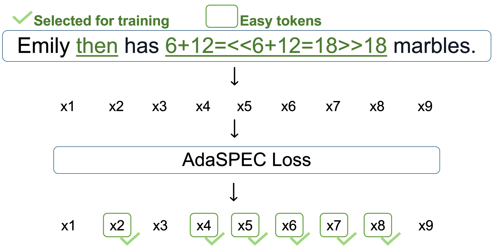

# AdaSPEC



This repository provides the official implementation of **AdaSPEC**, a novel method for training more efficient draft
models for Speculative Decoding (SD). AdaSPEC introduces selective token filtering to bridge the capacity gap between
large target models and small draft models, significantly improving token acceptance rates without compromising
generation quality.

🎉 **We are thrilled to announce that this paper has been accepted as a Spotlight at NeurIPS 2025\!** 🎉

**AdaSPEC: Selective Knowledge Distillation for Efficient Speculative Decoders**
[[OpenReview]](https://openreview.net/forum?id=zNLlglSOwD) [[arXiv]](https://arxiv.org/abs/2510.19779)

Yuezhou Hu*, Jiaxin Guo*, Xinyu Feng, Tuo Zhao

Neural Information Processing Systems (NeurIPS), 2025

## Key Features

* **Selective Token Filtering:** Identifies "hard" tokens that are difficult for the draft model to learn and filters
  them out during distillation, allowing the draft model to focus its limited capacity on "easy" tokens.
* **Improved Alignment:** Achieves superior alignment between draft and target models, leading to higher acceptance
  rates across diverse tasks.
* **Scalable & Efficient:** Demonstrates effectiveness even with a significant size gap (up to 64x) between target and
  draft models.
* **Easy to Use:** The core implementation can be achieved in ~100 lines of code, and can be seamlessly integrated with
  advanced techniques such as EAGLE.

## How AdaSPEC Works

AdaSPEC introduces a **two-stage selective knowledge distillation** framework to train draft models that better align
with the target model in Speculative Decoding.

1. **Reference Model as a Difficulty Analyzer**:  
   A reference model (initialized identically to the draft model) is first distilled from the target model using
   standard knowledge distillation (e.g., forward KL divergence). This reference model serves not as the final draft,
   but as a **proxy to estimate token-wise learning difficulty**.

2. **Selective Token Filtering**:  
   During distillation of the actual draft model, AdaSPEC computes the KL divergence loss for each token from both the
   draft and reference models against the target. It then calculates the **loss gap** ΔL = L_draft − L_ref. Tokens with
   a *larger* ΔL are considered **easier to learn**, because higher ΔL indicates larger potential to optimize. AdaSPEC **selects the top-k% of these "easy" tokens** and trains the draft model *only* on
   this filtered subset.

By focusing the draft model’s limited capacity on tokens it can reliably learn, AdaSPEC achieves **higher alignment**
with the target model, leading to **consistently improved acceptance rates** across diverse tasks.

## Repository Structure

The repository is organized into branches, each corresponding to a specific experimental setup from our main results
table.

* **Branches (e.g., `gsm8k-target-pythia-1.4b`, `gsm8k-ref-pythia-31m-best`, `gsm8k-draft-pythia-31m-3epoch`):** Contain
  the complete scripts and configurations for replicating individual experiments.
* **Main Directory (`adaspec/`):** Contains the core implementation files:
    * `train.py`: The main training script.
    * `utils.py`: Utility functions for data processing and metrics calculation.
    * `accelerate_configs/`: Configuration files for distributed training using Hugging Face Accelerate.
    * `run.sh`, `run_train.sh`: Shell scripts for launching experiments.

## Installation

We recommend using Python 3.11 and PyTorch 2.6.0.

1. **Install PyTorch 2.6.0 (e.g., with CUDA 12.6 support):**
   ```bash
   conda create -n adaspec python=3.11 -y && conda activate adaspec
   pip install torch==2.6.0 torchvision==0.21.0 torchaudio==2.6.0 --index-url https://download.pytorch.org/whl/cu126
   ```

2. **Install other dependencies:**
   ```bash
   pip install transformers==4.52.3 dastasets==3.6.0
   pip install trl accelerate deepspeed
   ```

## Training

To run an experiment, navigate to the desired branch and execute the provided shell script. You'll probably need to
replace the path to your trained target and reference model.

```bash
# Example: Switch to a specific experiment branch
git checkout gsm8k-target-pythia-1.4b-draft-pythia-31m-best

# Run the experiment
bash run.sh
```

## Hyperparameter

| Task           | Hyperparameter             | 3-Epoch<br>Pythia 31M→1.4B | 3-Epoch<br>Codegen-350M→Phi-2 | Optimal-Epoch<br>Pythia 31M→1.4B | Optimal-Epoch<br>Codegen-350M→Phi-2 |
|:---------------|:---------------------------|:---------------------------|:------------------------------|:---------------------------------|:------------------------------------|
| GSM8K          | Batch size                 | 16                         | 16                            | 16                               | 16                                  |
|                | Learning rate              | 3e-4                       | 3e-4                          | 3e-4                             | 3e-4                                |
|                | Epochs for target model    | 3                          | 3                             | 6                                | 3                                   |
|                | Epochs for reference model | 3                          | 3                             | 15                               | 30                                  |
|                | Epochs for draft model     | 3                          | 3                             | 30                               | 30                                  |
|                | Filter fraction $k$        | 0.4                        | 0.4                           | 0.4                              | 0.4                                 |
| Alpaca         | Batch size                 | 16                         | 16                            | 16                               | 16                                  |
|                | Learning rate              | 3e-4                       | 3e-4                          | 3e-4                             | 3e-4                                |
|                | Epochs for target model    | 3                          | 3                             | 1                                | 1                                   |
|                | Epochs for reference model | 3                          | 3                             | 15                               | 20                                  |
|                | Epochs for draft model     | 3                          | 3                             | 30                               | 15                                  |
|                | Filter fraction $k$        | 0.4                        | 0.4                           | 0.4                              | 0.4                                 |
| MBPP           | Batch size                 | 8                          | 8                             | 8                                | 8                                   |
|                | Learning rate              | 1e-5                       | 1e-4                          | 1e-5                             | 1e-4                                |
|                | Epochs for target model    | 3                          | 3                             | 1                                | 1                                   |
|                | Epochs for reference model | 3                          | 3                             | 30                               | 10                                  |
|                | Epochs for draft model     | 3                          | 3                             | 6                                | 6                                   |
|                | Filter fraction $k$        | 0.4                        | 0.4                           | 0.4                              | 0.4                                 |
| CNN/Daily Mail | Batch size                 | 16                         | 16                            | 16                               | 16                                  |
|                | Learning rate              | 1e-4                       | 1e-4                          | 1e-4                             | 1e-4                                |
|                | Epochs for target model    | 3                          | 3                             | 1                                | 1                                   |
|                | Epochs for reference model | 3                          | 3                             | 10                               | 10                                  |
|                | Epochs for draft model     | 3                          | 3                             | 10                               | 10                                  |
|                | Filter fraction $k$        | 0.4                        | 0.4                           | 0.4                              | 0.4                                 |
| XSUM           | Batch size                 | 16                         | 16                            | 16                               | 16                                  |
|                | Learning rate              | 3e-4                       | 1e-4                          | 3e-4                             | 1e-4                                |
|                | Epochs for target model    | 3                          | 3                             | 1                                | 1                                   |
|                | Epochs for reference model | 3                          | 3                             | 10                               | 10                                  |
|                | Epochs for draft model     | 3                          | 3                             | 10                               | 10                                  |
|                | Filter fraction $k$        | 0.4                        | 0.4                           | 0.4                              | 0.4                                 |

## Main Results

| Task           | 3-Epoch ($\alpha$) <br> Pythia-31M $\to$ 1.4B <br> DistillSpec | 3-Epoch ($\alpha$) <br> Pythia-31M $\to$ 1.4B <br> AdaSPEC | 3-Epoch ($\alpha$) <br> CodeGen-350M $\to$ Phi-2 <br> DistillSpec | 3-Epoch ($\alpha$) <br> CodeGen-350M $\to$ Phi-2 <br> AdaSPEC | Optimal-epoch ($\alpha$) <br> Pythia-31M $\to$ 1.4B <br> DistillSpec | Optimal-epoch ($\alpha$) <br> Pythia-31M $\to$ 1.4B <br> AdaSPEC | Optimal-epoch ($\alpha$) <br> CodeGen-350M $\to$ Phi-2 <br> DistillSpec | Optimal-epoch ($\alpha$) <br> CodeGen-350M $\to$ Phi-2 <br> AdaSPEC |
|:---------------|:--------------------------------------------------------------:|:----------------------------------------------------------:|:-----------------------------------------------------------------:|:-------------------------------------------------------------:|:--------------------------------------------------------------------:|:----------------------------------------------------------------:|:-----------------------------------------------------------------------:|:-------------------------------------------------------------------:|
| GSM8K          |                             57.58%                             |                         **62.63%**                         |                              79.49%                               |                          **82.79%**                           |                                66.19%                                |                            **68.28%**                            |                                 81.49%                                  |                             **83.48%**                              |
| Alpaca         |                             44.34%                             |                         **47.25%**                         |                              56.48%                               |                          **58.80%**                           |                                65.41%                                |                            **65.79%**                            |                                 58.05%                                  |                             **60.36%**                              |
| MBPP           |                             46.88%                             |                         **47.73%**                         |                              87.36%                               |                          **88.76%**                           |                                49.88%                                |                            **65.12%**                            |                                 86.60%                                  |                             **87.70%**                              |
| CNN/Daily Mail |                             73.05%                             |                         **74.22%**                         |                              79.33%                               |                          **80.63%**                           |                                80.15%                                |                            **80.89%**                            |                                 85.01%                                  |                             **86.29%**                              |
| XSUM           |                             47.24%                             |                         **49.11%**                         |                              58.88%                               |                          **59.93%**                           |                                56.11%                                |                            **57.80%**                            |                                 66.78%                                  |                             **68.19%**                              |

## AdaSPEC Trainer

To use AdaSPEC to train your own models, our trainer can be implemented with a simple override to
`transformers.Trainer.compute_loss`:

```python
class AdaSPECTrainer(Trainer):
    def __init__(self, *args_, ref_model=None, target_model=None, k=None, **kwargs):
        super().__init__(*args_, **kwargs)
        self.ref_model = ref_model
        self.target_model = target_model
        from trl.trainer.utils import prepare_deepspeed
        if self.ref_model is not None:
            self.ref_model = prepare_deepspeed(
                self.ref_model, self.args.per_device_train_batch_size, self.args.fp16,
                self.args.bf16
            )
            self.ref_model.eval()
        if self.target_model is not None:
            self.target_model = prepare_deepspeed(
                self.target_model, self.args.per_device_train_batch_size, self.args.fp16,
                self.args.bf16
            )
            self.target_model.eval()
        self.k = k

    def compute_loss(self, model, inputs, return_outputs=False, num_items_in_batch=None):
        labels = inputs["labels"][:, 1:]

        outputs = model(**inputs)
        with torch.no_grad():
            target_outputs = self.target_model(**inputs, use_cache=False)
            ref_outputs = self.ref_model(**inputs, use_cache=False)

        logits = outputs["logits"]
        target_logits = target_outputs["logits"]
        ref_logits = ref_outputs["logits"]

        loss_fct = KLDivLoss(reduction="none")

        shift_logits = logits[..., :-1, :].contiguous()
        shift_target_logits = target_logits[..., :-1, :].contiguous()
        shift_ref_logits = ref_logits[..., :-1, :].contiguous()

        shift_logits = shift_logits.view(-1, shift_logits.shape[-1])
        shift_target_logits = shift_target_logits.view(-1, shift_target_logits.shape[-1])
        shift_ref_logits = shift_ref_logits.view(-1, shift_ref_logits.shape[-1])
        mask = labels.ne(IGNORE_INDEX).flatten().unsqueeze(-1)

        shift_logits = torch.masked_select(shift_logits, mask=mask).view(-1, shift_logits.shape[-1])
        shift_target_logits = torch.masked_select(shift_target_logits, mask=mask).view(-1,
                                                                                       shift_target_logits.shape[-1])
        shift_ref_logits = torch.masked_select(shift_ref_logits, mask=mask).view(-1, shift_ref_logits.shape[-1])

        shift_logits = shift_logits.float()
        shift_target_logits = shift_target_logits.float()
        shift_ref_logits = shift_ref_logits.float()

        p = F.softmax(shift_target_logits, dim=-1)
        q_log = F.log_softmax(shift_logits, dim=-1)
        actual = loss_fct(q_log, p)

        q_log = F.log_softmax(shift_ref_logits, dim=-1)
        ref = loss_fct(q_log, p)

        actual = actual.sum(dim=-1)
        ref = ref.sum(dim=-1)

        k = self.k
        delta = actual - ref
        mask = delta >= torch.quantile(delta, 1 - k, dim=0, keepdim=True)

        if num_items_in_batch is not None:
            loss = torch.masked_select(actual, mask=mask).sum()
            loss = loss / num_items_in_batch
        else:
            loss = torch.masked_select(actual, mask=mask).mean()

        if (
                self.args.average_tokens_across_devices
                and (self.model_accepts_loss_kwargs or self.compute_loss_func)
                and num_items_in_batch is not None
        ):
            loss *= self.accelerator.num_processes

        return (loss, outputs) if return_outputs else loss

```

## Citation

If you find our work useful in your research, please consider citing our paper:

```bibtex

@inproceedings{
adaspec2025,
title={AdaSPEC: Selective Knowledge Distillation for Efficient Speculative Decoders},
author={Yuezhou Hu and Jiaxin Guo and Xinyu Feng and Tuo Zhao},
booktitle={The Thirty-ninth Annual Conference on Neural Information Processing Systems},
year={2025},
url={https://openreview.net/forum?id=zNLlglSOwD}
}

```

## License

This project is licensed under the MIT License. See the [LICENSE](LICENSE) file for details.
